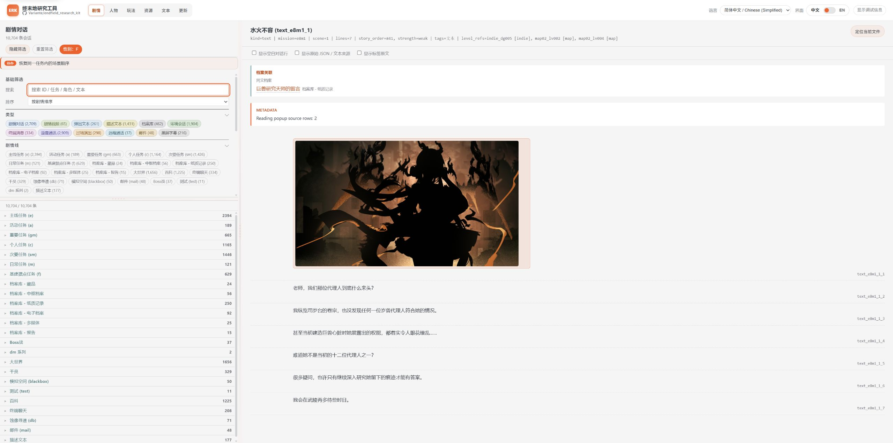
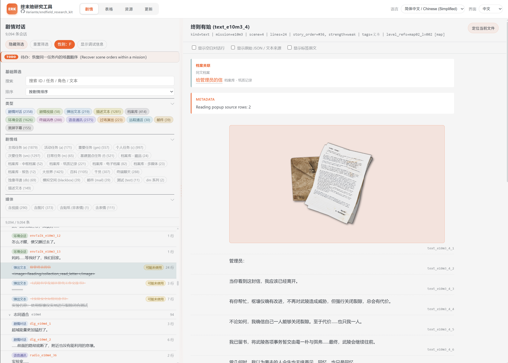
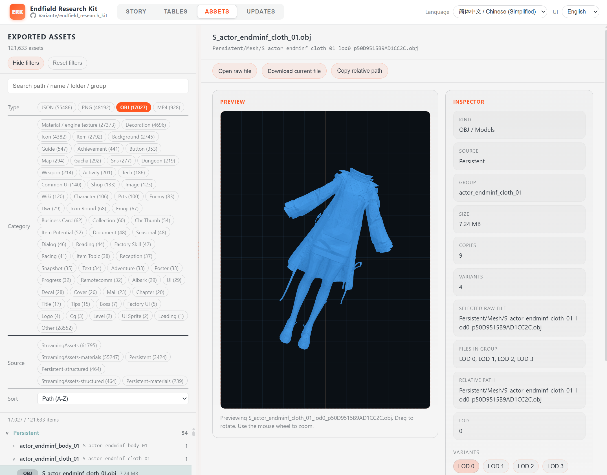
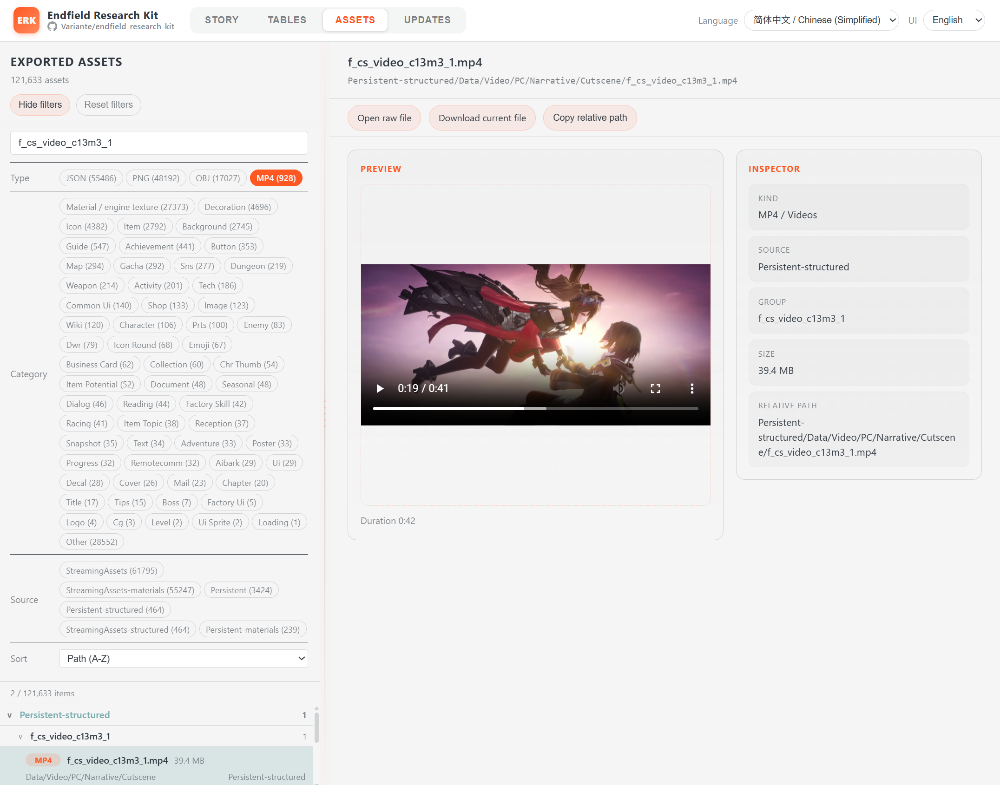

# Endfield Research Kit

Endfield Research Kit turns a local Windows installation of Endfield into an
offline static research browser. The WebUI exposes recovered Story, Text
Tables, Gameplay, Assets, game-update comparisons, and an experimental Mission
Pipeline.

<p>
  
  
  
  
</p>

> Research only. Use a legally obtained client, do not redistribute proprietary
> game content, and expect spoilers. Most recovery work was produced with LLM
> assistance and should be verified against the original data.

中文: [b站专栏](https://www.bilibili.com/opus/1212936027582234627)，[百度盘](http://pan.baidu.com/s/1nLaAc6-AdZAbZb6jGObtmA?pwd=94p7)

## Quick start

Requirements: Git, Python 3, a local Endfield client, adequate disk space, and
preferably 64 GiB RAM for default asset exports.

```bat
git clone https://github.com/Variante/endfield_research_kit.git
cd endfield_research_kit
notepad endfield_paths.bat
.\setup_first_time.bat
```

Set `ENDFIELD_GAME_ROOT` to the installed `Endfield_Data` directory.
`setup_first_time.bat` initializes AnimeStudio, builds the CLI, exports the
core WebUI data, and starts or reuses:

```text
http://127.0.0.1:8765/
```

Use `--no-serve` to build without starting the server.

## Common commands

```bat
:: Rebuild the WebUI from the existing export_full
.\export.bat

:: Refresh Story and assets from the installed game
.\export.bat --export-from-game --with-assets

:: Fast Story/Mission Pipeline recovery loop
.\export.bat --mission-pipeline-only --reuse-timeline-orders --reuse-reference

:: Rebuild only Mission Pipeline data when Story inputs are current
.\export.bat --mission-pipeline-data-only

:: Rebuild asset indexes and relink existing CN audio
.\export_assets.bat

:: Refresh assets and CN audio from the installed game
.\export_assets.bat --export-from-game

:: Serve the static WebUI
python serve.py

:: Package the WebUI
.\pack_webui.bat
```

`export.bat` reuses `export_full/` by default and checks that it matches the
installed game. Use `--export-from-game` only when the installed data changed
or a fresh extraction is intentional.

Asset refresh modes:

- `--focused-assets`: smaller browser-referenced texture export.
- `--default-assets`: normal WebUI image/model/material/audio export.
- `--debug-assets`: broad diagnostic conversion.
- `--animestudio-jobs N`: reduce concurrency when memory is limited.

To build additional languages:

```bat
python scripts\story_builder\build.py --languages CN EN JP --default-language CN
```

## Game updates

```bat
:: First export: create an empty Updates feed
.\build_updates.bat --init-build

:: Seed installed-game VFS change detection
.\build_updates_by_patch.bat --init-baseline

:: Detect, stage, publish, and report a game update
.\build_updates_by_patch.bat

:: Detection only
.\build_updates_by_patch.bat --check

:: Compare two complete extracted versions
.\build_updates.bat --previous-export-root OLD --export-root NEW --refresh-previous-export-baseline
```

Updates compare exported game-data roots, not `webui/`, `reports/`, `memory/`,
or local source edits.

## Current recovery status

### Story

- 5,564 unique Story files across 606 pipeline missions.
- 4,237 files have an accepted mission/context connection (**76.1%**).
- 4,462 have a normalized trigger/context route (**80.2%**).
- 1,327 remain unlinked; 156 already have exact native playback but lack a
  mission/quest activation bridge.
- 27 exact ordered-`Branch` contexts across four missions now expose every
  serialized arm and its original-binary hashes; no multi-arm Story-order edge
  is admitted until a second arm is proven by an original path or runtime trace.
- A general original-binary Encounter contract now adds exact controller and
  related LevelData/SpawnerConfig context for 27 of those Story keys. Its
  LsmPtr module namespace is shown separately from the receiver LevelScript,
  without inventing mission ownership or order.
- A general recursive ActionHeader validator now exposes all 30 exact receiver
  playback gates, including AND/OR/NOT/ALL trees, comparisons, property/stage,
  LSM-completion, and interactive-state leaves, without treating those local
  predicates as mission ownership or cross-Story order.
- All 259 named native branch predicates are operand-decoded where their
  current binary layout is supported; the pipeline reports 264 semantic
  predicates including inline forms, with 0 class-only and 0 unresolved.
- Parallel Split semantics now come from a general original-binary scheduler
  census rather than an action-name rule: two writer methods and all three
  direct scheduler calls validate, covering 44 branch groups and 77 exact
  Story transitions while keeping sibling slots unordered.
- A general installed-binary quest-lifecycle rule adds 22 exact same-quest
  objective-to-succeed-action Story edges across 18 missions; each carries its
  original MissionRuntime and binary hashes without inferring server branch choice.
- The same general dispatcher census proves Fail=4 and Succeed=2 across every
  current AOT fallback path, while finding no Start=1 producer. The WebUI keeps
  60 authored start roots visible in quest inspectors; 57 have typed Story
  references, and the 53 candidate-scene matches appear as attached definition
  cards without turning them into scene order.
- Installed metadata now names every authored fork arm's numeric `questType`
  (`Normal`, `Block`, or `Optional`) and `showMode` (`AlwaysShow` or
  `AlwaysHide`). The complete direct-consumer audit finds seven quest-type
  methods: the sole `Optional` comparison sets the exact objective-display
  `optional` flag, while two `Block` comparisons emit a global notification
  only after lifecycle application. Five visibility methods make zero
  lifecycle calls. These labels explain client presentation and notification,
  but do not select or exclude a successor.
- The source-only graph is cycle-free, but proves order for only **1.54%** of
  possible within-mission scene pairs. It is a partial order, not a canonical
  full playthrough.

The largest missing Story source is a server/runtime ownership bridge joining
LevelScripts to missions and quests. Details:
[`memory/game_story_recovery.md`](memory/game_story_recovery.md).

### Character models and animation

- All 30 playable models are imported and render successfully.
- All 156 canonical post-model identities have generated prefab paths:
  30 playables, 2 NPC characters, 1 cutscene clone, 94 enemies, and 29
  ability/prop actors.
- Playable UI animation recovery includes 754 body clips and 321 private
  item/deco clips.
- Static playable Overview assets are highly recovered, but retail rendering
  parity is not reached. CharacterNPR coverage is roughly 60–75%; the complete
  CharInfo/HGRP frame is roughly 35–50%.

The main remaining work is HGRP lighting, shadows, depth/GBuffer/deferred
composition, live material state, controller execution, IK, facial behavior,
physics, and non-playable animation. Details:
[`memory/character_render_and_animation_recovery.md`](memory/character_render_and_animation_recovery.md).

## Repository layout

- `webui/`: static browser and generated data.
- `scripts/`: export, build, update, audio, and packaging tools.
- `tools/AnimeStudio/`: tracked exporter fork.
- `export_full/`: generated extraction from the installed client.
- `reports/`: generated audits grouped by topic.
- `memory/`: concise current conclusions and recovery queues.
- `scratch/`: revisitable experiments.
- `tmp/`: disposable intermediates.
- `unity_endfield_graph_shader_lab/`: character rendering/animation recovery.

Further documentation:

- [`scripts/README.md`](scripts/README.md): maintained command and script map.
- [`webui/README.md`](webui/README.md): frontend scope and data contract.
- [`memory/README.md`](memory/README.md): recovery-status index.
- `AGENTS.md`: detailed contributor and automation rules.

## Acknowledgements

The local `tools/AnimeStudio` fork contains custom Endfield VFS, asset,
MonoBehaviour, shader, animation, and audio recovery work informed by
[fluffy-dumper](https://git.nekolab.app/fluffield/fluffy-dumper) and
[EIHRTeam/EndfieldStudio](https://github.com/EIHRTeam/EndfieldStudio). Many
thanks to those projects and their maintainers for the groundwork that made
this research workflow possible.

Special thanks to these LLM-driven community wiki projects. They are not
affiliated with this repository, but they are useful public references:

- [AIC | Endfield Industrial Terminal](https://endfield.prts.chat/) is an
  AI-assisted Endfield wiki/reference project for browsing organized public
  game information.
- [PRTS | Rhodes Island Terminal](https://prts.chat/) is an AI-assisted
  Arknights wiki/reference project covering the broader setting.

These resources complement this local research workspace; important claims
should still be checked against primary game data.
