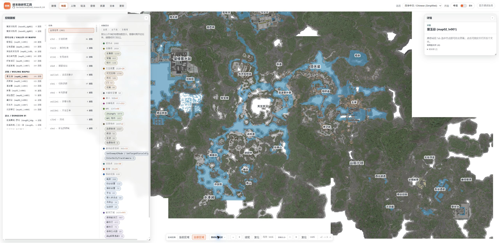

# Endfield Research Kit

Endfield Research Kit turns a local Windows installation of Endfield into an
offline static research browser. The WebUI brings recovered Story, character
identities, gameplay data, exported assets, localized text, and game-update
comparisons into one searchable interface.

<p>
  
  
  
  
  
</p>

> Research only. Use a legally obtained client, do not redistribute proprietary
> game content, and expect spoilers. Most recovery work was produced with LLM
> assistance and should be verified against the original data.

中文: [b站专栏](https://www.bilibili.com/opus/1212936027582234627)，[百度盘](http://pan.baidu.com/s/1nLaAc6-AdZAbZb6jGObtmA?pwd=94p7)

## Quick start

Requirements: Git, Python 3, a local Endfield client, adequate disk space, and
preferably 64 GiB RAM for default asset exports.

```bat
git clone https://github.com/Variante/endfield_research_kit.git
cd endfield_research_kit
notepad endfield_paths.bat
.\setup_first_time.bat
```

Set `ENDFIELD_GAME_ROOT` to the installed `Endfield_Data` directory.
`setup_first_time.bat` builds AnimeStudio, exports CN Story and Text data, and
starts or reuses `http://127.0.0.1:8765/`. Pass `--no-serve` to build without
starting the server.

## WebUI

- **Story** reconstructs dialog, radio, SNS, cutscenes, options, media, and
  evidence-typed ordering.
- **Map** stitches authored regional screens with recovered grayscale elevation,
  colored surfaces, water, point clouds, missions, and exact world coordinates.
- **Characters** groups identity evidence and supports live merge/name
  overrides.
- **Gameplay** covers characters, equipment, enemies, progression, skills,
  projectiles, related assets, and recovered sound effects.
- **Audio** exposes decoded voices, music, sound effects, event relationships,
  and playback evidence.
- **Assets** browses exported images, videos, materials, models, and their
  recovered references.
- **Text** provides searchable localized tables and source records.
- **Updates** compares exported game data across two saved versions.
- **Mission Pipeline** is an experimental debug-only quest/Story evidence view.

First-time setup generates Story and Text. Run `export.bat --from-game --with-assets` to build the remaining WebUI data and refresh assets and audio. Updates requires two complete exports.

## Common workflows

```bat
:: Rebuild WebUI data from the current export_full
.\export.bat

:: Refresh Story and assets in one installed-game export
.\export.bat --from-game --with-assets

:: Rebuild Story and Mission Pipeline with reusable inputs
.\export.bat --mission-pipeline-only --reuse-timeline-orders --reuse-reference

:: Rebuild only Mission Pipeline/map JSON when Story inputs are current
.\export.bat --mission-pipeline-data-only

:: Rebuild post-Story views plus existing assets/audio
.\export_assets.bat
:: Refresh assets only when Story/Table exports already match this game build
.\export_assets.bat --from-game

:: Serve or package the static WebUI
python serve.py
python scripts\pack_webui.py
```

`export.bat` reuses `export_full/` and checks it against the installed client.
Add `--from-game` only for an intentional extraction. Asset scope runs from
`--focused-assets` through `--default-assets` to `--debug-assets`;
`--asset-jobs N` and `--webui-jobs N` cap concurrency. Every wrapper supports
`--help`.

Audio is lossless FLAC by default and is encoded directly without temporary WAV
files or `ffmpeg`. Optional asset decoding can take several hours and substantial
disk space and memory.

To build more languages:

```bat
python -m scripts.story_builder.build --languages CN EN JP --default-language CN
```

## Game updates

```bat
:: Compare two complete exports, old folder first
.\build_updates.bat OLD NEW
```

The wrapper accepts `OLD NEW` or reads both roots from `endfield_paths.bat`.
It compares exported text, image, model, video, and decoded audio data; local
changes under `webui/`, `reports/`, `memory/`, or `scratch/` never appear in the
feed. See [scripts/README.md](scripts/README.md) for focused, text-only, and
exact-hash options.

### Story

- The CN build contains 5,563 Story files; 4,236 have an accepted pipeline
  connection and 1,327 remain unlinked.
- The source-only graph is cycle-free but sparse. It is an evidence-typed
  partial order, not a claimed canonical playthrough.

Current counts live in
[`reports/story/build/mission_pipeline_story_binding_coverage_CN.md`](reports/story/build/mission_pipeline_story_binding_coverage_CN.md)
and [`reports/mission_order/source_story_partial_order_CN.md`](reports/mission_order/source_story_partial_order_CN.md).
Stable conclusions and next work live in
[`memory/game_story_recovery.md`](memory/game_story_recovery.md).

### Game data and combat

- Stock-client damage, defense, resistance, critical, healing, poise, and
  shield paths are recovered from binaries, IL2CPP metadata, and authored data.
- Skills and buffs retain action, modifier, timing, and ownership evidence.
  Server corrections, active patches, and live branch selection remain outside
  the proven boundary.

See [`memory/game_data_recovery.md`](memory/game_data_recovery.md) for the
formula overview and current limits.

### Character models and animation

- All 31 playable models render in the Unity lab, and all 156 canonical
  post-model identities have generated prefab paths.
- Playable UI animation coverage is complete for the selected scope. Retail
  lighting, material state, controllers, IK, facial behavior, physics, and
  non-playable animation remain incomplete.

See
[`memory/character_render_and_animation_recovery.md`](memory/character_render_and_animation_recovery.md)
for the current evidence boundary.

## Project map

- `webui/`: static browser, runtime overrides, and generated data.
- `scripts/`: maintained export, build, update, audio, and packaging tools.
- `tools/AnimeStudio/`: tracked exporter fork.
- `export_full/`: generated extraction from the installed client.
- `reports/`: generated inventories and audits.
- `memory/`: current conclusions, evidence boundaries, and recovery queues.
- `scratch/`: revisitable experiments; `tmp/`: disposable intermediates.
- `unity_endfield_graph_shader_lab/`: character rendering and animation lab.

Technical documentation:

- [`scripts/README.md`](scripts/README.md): command and script map.
- [`webui/README.md`](webui/README.md): frontend scope and data contracts.
- [`memory/README.md`](memory/README.md): recovery-topic index.
- `AGENTS.md`: contributor and automation rules.

## Acknowledgements

The local `tools/AnimeStudio` fork contains custom Endfield VFS, asset,
MonoBehaviour, shader, animation, and audio recovery work informed by
[fluffy-dumper](https://git.nekolab.app/fluffield/fluffy-dumper) and
[EIHRTeam/EndfieldStudio](https://github.com/EIHRTeam/EndfieldStudio). Many
thanks to those projects and their maintainers for the groundwork that made
this research workflow possible.

Shader recovery was also informed by
[Ruri.ShaderDecompiler](https://github.com/ShiyumeMeguri/Ruri.ShaderDecompiler).
It remains credited as historical/provenance work; the maintained Endfield
export path is being consolidated into AnimeStudio.

Special thanks to these LLM-driven community wiki projects. They are not
affiliated with this repository, but they are useful public references:

- [AIC | Endfield Industrial Terminal](https://endfield.prts.chat/)
- [PRTS | Rhodes Island Terminal](https://prts.chat/)

These resources complement this local research workspace; important claims
should still be checked against primary game data.
