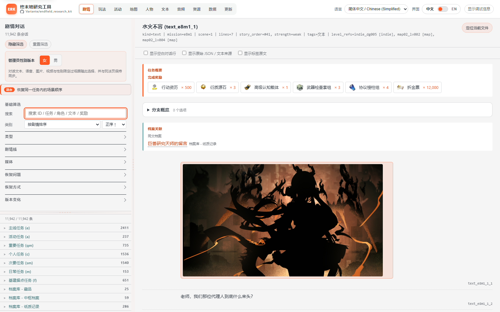
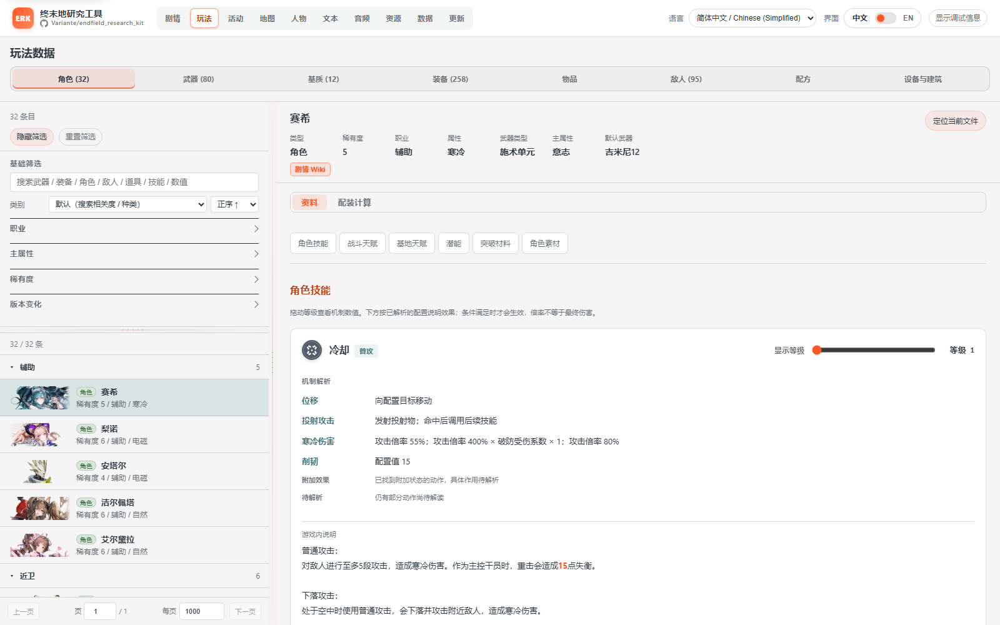
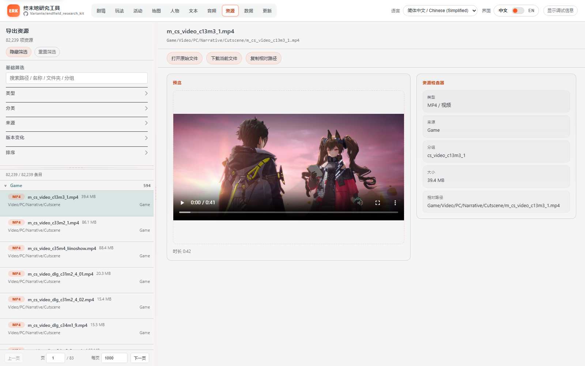
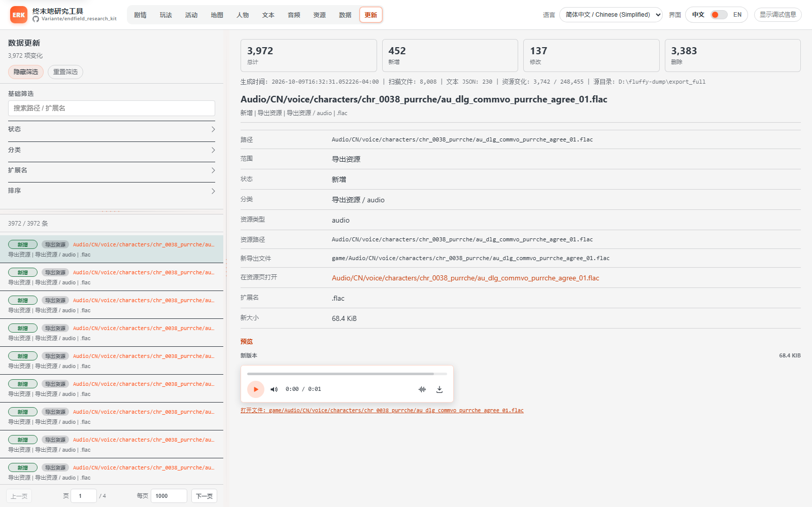
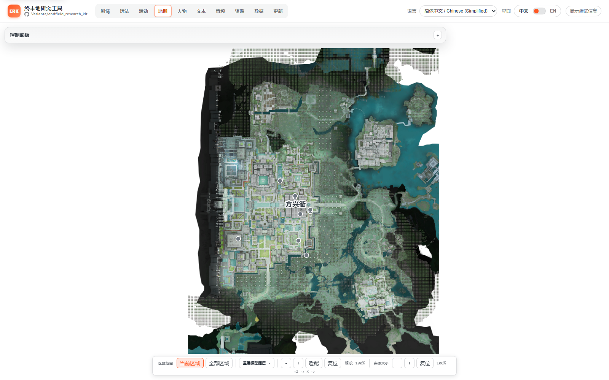

# Endfield Research Kit

Endfield Research Kit turns a local Windows installation of Endfield into an
offline static research browser. The WebUI brings recovered Story, character
identities, gameplay data, exported assets, localized text, and game-update
comparisons into one searchable interface.

<p>
  
  
  
  
  
</p>

> [!CAUTION]
> This is an unofficial community project and is not affiliated with or endorsed
> by the game's developers or publishers. Use a legally obtained client, do not
> redistribute proprietary game content, and expect spoilers. Most recovery
> work was produced with LLM assistance and should be verified against the
> original data.
>
> This project and its documentation are provided **AS IS**, without warranties
> of any kind. There is no promise of support, bug fixes, compatibility with
> future game or operating-system updates, or long-term maintenance. Use it at
> your own risk; you should not expect assistance or continued updates.

## Quick start

Requirements: Git, Python 3, a local Endfield client, adequate disk space, and
preferably 64 GiB RAM for default asset exports.

```bat
git clone https://github.com/Variante/endfield_research_kit.git
cd endfield_research_kit
notepad endfield_paths.bat
.\setup.bat
```

Set `ENDFIELD_GAME_ROOT` to the installed `Endfield_Data` directory.
`setup.bat` builds AnimeStudio, exports CN Story and Text data, and
starts or reuses `http://127.0.0.1:8765/`. Pass `--no-serve` to build without
starting the server. When setup finishes, the **Story** and **Text** pages are
ready to browse. The remaining pages are separate so the first useful build
finishes sooner.

The other pages are built page by page, and each extracts only what it reads
from the installed client. Build one of them, or all of them including
exported media and CN audio, after setup:

```bat
.\export.bat map --from-game
.\export.bat --from-game
```

Asset decoding can take several hours and requires substantially more disk
space and memory than the initial Story/Text setup.

## WebUI

- **Story** reconstructs dialog, radio, SNS, cutscenes, options, media, and
  evidence-typed ordering, with local branch overviews.
- **Map** stitches authored regional screens with recovered grayscale elevation,
  colored surfaces, water, missions, encounters, patrols, and scene conditions.
- **Characters** groups identity evidence, lists complete source appearances
  with verified Story links, and supports live merge/name overrides.
- **Gameplay** covers characters, equipment, enemies, progression, authored
  skill/action references, projectiles, and related assets. Its Items, Recipes
  and Machines tabs connect item effects and rewards to crafting, shop
  configurations, upgrade uses, and source tables.
- **Text** provides searchable localized tables, achievement targets, activity
  prerequisites, and configured rewards.
- **Audio** exposes decoded voices, music, sound effects, event relationships,
  and playback evidence.
- **Assets** browses exported images, videos, and models with their linked
  materials and recovered references.
- **Data** is a file viewer and SQL console over every decoded export output
  the other pages do not show: every Unity object document (MonoBehaviour,
  TextAsset, Material, AnimationClip, ...), every packed game file (such as
  LipSync), and the loose tables, JsonData, Lua, Terrain, shaders and fonts,
  plus the files nothing decodes yet (streaming chunks, irradiance volumes,
  extend data, patches), shown as bytes. Search by
  name, object name, PathID, or CAB; read JSON as a tree with base64 decoded
  inline; or query with read-only SQL. It also keeps the decoded datasets of
  the maintained binary readers.
- **Updates** compares exported game data across two saved versions.

### Pages prepared by each command

`export.bat` is grouped by page: name the pages to build (none means all of
them). After a command succeeds, the named pages are ready or refreshed; pages
not named keep their previously generated data.

| Command | Pages ready or refreshed | What it uses |
| --- | --- | --- |
| `.\setup.bat` | **Story**, **Text** | Installed client; also builds AnimeStudio and starts the WebUI server by default |
| `.\export.bat` | Every page except **Updates** | The current export, after checking that every input the pages read is present and current |
| `.\export.bat --from-game` | Every page except **Updates** | Extracts only what the pages read, decodes CN audio, then builds them |
| `.\export.bat story --from-game` | **Story**, **Text** | Text only: tables, JsonData and the Story Unity classes; no image, video or audio |
| `.\export.bat story-media --from-game` | **Story**, **Text** | Story with its images and videos |
| `.\export.bat story audio --from-game` | **Story**, **Text**, **Audio** | Text-only Story plus the Audio page, which also gives Story its voice lines |
| `.\export.bat map --from-game` | **Map** | Extracts only Map's inputs |
| `.\export.bat debug --from-game` | Every page except **Updates** | Extracts every supported structured block and Unity class, then builds every page |
| `.\export.bat --changed-only` | Every page except **Updates** | Applies only changed structured files from the installed client and reuses exported media |
| `.\build_updates.bat OLD NEW` | **Updates** | Compares two complete export folders |

The export scopes are `story` (with Text; `story-media` adds its images and videos),
`map`, `characters`, `gameplay`, `production`, `audio`, `assets` and `data`. A page builds
only its publication. `gameplay production` refreshes every Gameplay tab.
Story's voice lines come from the Audio page and the asset links
on Map, Characters and Gameplay from the Assets page, each appearing once that
page has been built;
`.\export.bat --help` lists what each one includes. A build without
`--from-game` refuses inputs extracted from an older client build, and names
the pages to re-extract.

### What each page extracts

The chart below shows what each page reads from the export and which other
pages' published output it shows. A page run extracts only its column and
builds only that page; what it reads from another page is that page's last
publication, or the page goes without it. Data shows every
decodable output the other pages do not, so extracting every page (no page
named) extracts everything, the same as `debug`. The page registry,
[`scripts/webui/pages.py`](scripts/webui/pages.py), is the source of truth;
`.\export.bat PAGE --from-game --show-plan` prints the same information for a
run.

<p align="center">
  
</p>

`python serve.py` serves whatever has already been generated; it does not build
page data. The **Data** page's file viewer and SQL console are the exception:
they query the export's `Unity.sqlite` and `GameFiles.sqlite` live through
`serve.py`, so they need no build step but do need the repository's
`serve.py` (restart it after updating the code). A packaged WebUI has no such
server, so there the Data page shows only its decoded datasets.
`python -m scripts.webui.package` packages the current generated WebUI
without refreshing it.

Mission Pipeline recovery remains available as a separate direct Python
workflow, but is no longer a WebUI page or part of the WebUI export commands.

## What an export produces

`export_full/` holds one decoded copy of the game data. `game/` is what the
client actually loads (the newer Persistent layer overlaid on StreamingAssets),
and `meta/` only describes it, so nothing in `game/` is a duplicate or an
intermediate result:

```text
export_full/
  layout.json                 marker: schema + writing|complete
  game/
    Table/ Json/ Video/       final VFS files (the client's `Data/` prefix dropped)
    GameFiles.sqlite          packed small-file folders (Json/LipSync)
    Terrain/ Lua/             only when the export scope includes them
    Audio/<LANG|shared>/      decoded Wwise audio
    Unity.sqlite              every decoded Unity object document (JSON, .anim)
    Unity/<Type>/             converted Unity media (PNG, OBJ, FBX), one folder per type
  meta/
    <Layer>/…                 per-layer VFS index, asset map, object index,
                              asset status, export manifest
    cab_map/ extraction/      container map, failures, incremental state
```

Rough size of a complete export (`--from-game`), from the current
client:

| Part | Files | Size |
| --- | --- | --- |
| `game/Unity.sqlite` | 1 (~1.7 M objects) | ~5 GB |
| `game/Unity` media | ~0.2 M | ~64 GB |
| `game/Audio` | ~93 K | ~30 GB |
| `game/Video` | ~600 | ~6 GB |
| `game/Json` | ~21 K | ~0.2 GB |
| `game/GameFiles.sqlite` | 1 (~74 K files) | ~0.3 GB |
| `game/Table` | ~700 | ~0.3 GB |
| `meta` | ~120 | ~3 GB |
| **Total** | **~0.4 M** | **~110 GB** |

Budget roughly double that during a run: AnimeStudio stages into
`tmp/game_data/export/` (which doubles as its per-asset reuse cache) and only
then publishes into `game/`: media as hardlinks, object documents into
`Unity.sqlite`, and `Json/LipSync` into `GameFiles.sqlite`. An export saved
before those stores existed (layout v2 or v3) is converted once with
`python -m scripts.game_data.extraction.pack_export_stores --export-root <folder>`.
Generated browser data in `webui/data/` adds a few GB more.

Time and memory, measured on a desktop with 8 AnimeStudio workers (the
`--asset-jobs` default):

| Step | Time | Peak RAM |
| --- | --- | --- |
| `--from-game` extraction of every page | ~3-4 h | up to ~40 GB |
| Story build (`export.bat` without `--from-game`) | ~25 min | a few GB |
| Post-Story pages (Gameplay, Characters, Map, source graph) | ~15 min | a few GB |
| `build_updates.bat` between two exports | ~10 min | a few GB |

Plan for 64 GB of RAM for a full installed-client export, or pass
`--asset-jobs 4` (or lower) to trade speed for a smaller footprint: peak memory
scales with the number of parallel workers. The other commands are comfortable
on a normal 16 GB machine. An interrupted export leaves `layout.json` at
`writing` and publishes nothing, so `game/` keeps the previous complete export
until a run finishes.

## Project map

- `webui/`: static browser, runtime overrides, and generated data.
- `scripts/`: maintained export, build, update, audio, and packaging tools.
- `tools/AnimeStudio/`: tracked exporter fork.
- `export_full/`: generated extraction from the installed client.
- `reports/`: generated inventories and audits.
- `memory/`: current conclusions, evidence boundaries, and recovery queues.
- `scratch/`: revisitable experiments; `tmp/`: disposable intermediates.

Only `tools/AnimeStudio` is initialized by `setup.bat`. The
`tools/Cpp2IL-Endfield` submodule is optional and is not required for the
normal WebUI workflow.

Technical documentation:

- [`scripts/README.md`](scripts/README.md): command and script map.
- [`webui/README.md`](webui/README.md): frontend scope and data contracts.
- [`memory/README.md`](memory/README.md): recovery-topic index.
- `AGENTS.md`: contributor and automation rules.

## Acknowledgements

The local `tools/AnimeStudio` fork contains custom Endfield VFS, asset,
MonoBehaviour, shader, animation, and audio recovery work informed by
[fluffy-dumper](https://git.nekolab.app/fluffield/fluffy-dumper) and
[EIHRTeam/EndfieldStudio](https://github.com/EIHRTeam/EndfieldStudio). Many
thanks to those projects and their maintainers for the groundwork that made
this research workflow possible.

Shader recovery was also informed by
[Ruri.ShaderDecompiler](https://github.com/ShiyumeMeguri/Ruri.ShaderDecompiler).
It remains credited as historical/provenance work; the maintained Endfield
export path is being consolidated into AnimeStudio.

Special thanks to these LLM-driven community wiki projects. They are not
affiliated with this repository, but they are useful public references:

- [AIC | Endfield Industrial Terminal](https://endfield.prts.chat/)
- [PRTS | Rhodes Island Terminal](https://prts.chat/)

These resources complement this local research workspace; important claims
should still be checked against primary game data.
